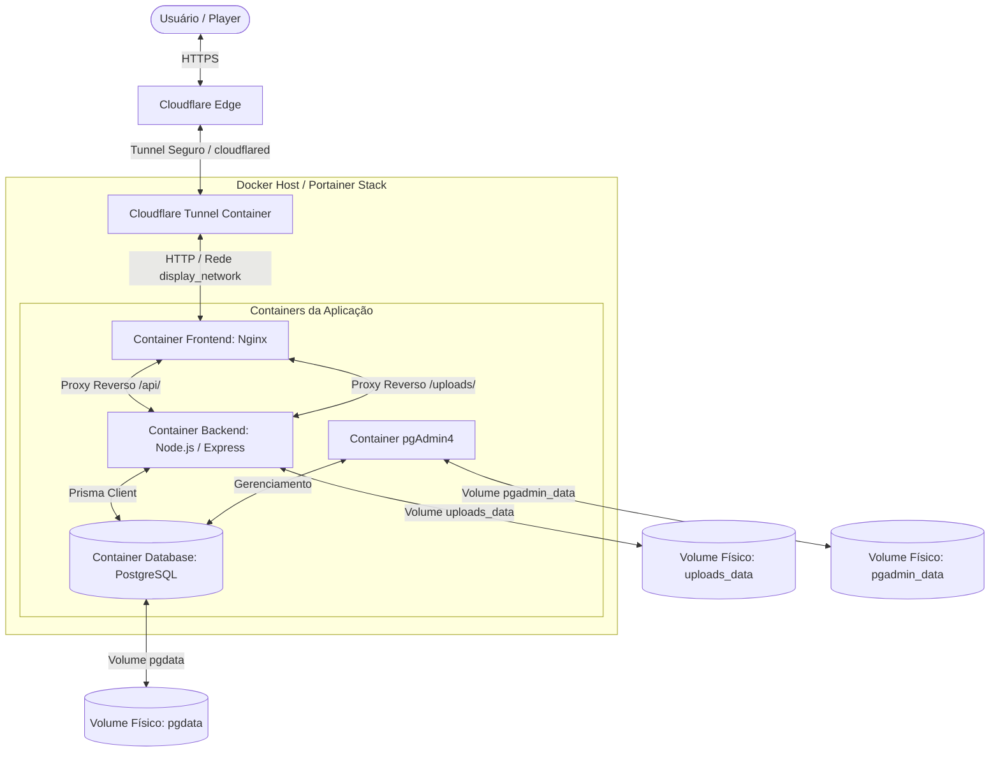

# 🚀 Guia Direcional de Refatoração e Padronização Arquitetural
> **Roadmap Técnico:** Migração de Supabase/Serverless para Infraestrutura Própria (Self-Hosted) com Docker Compose, Portainer e Cloudflare Tunnel.

---

## 1. Visão Geral e Objetivos

Este documento serve como um guia técnico para padronizar e refatorar seus outros projetos de software, alinhando-os com a arquitetura moderna, robusta e auto-hospedada (self-hosted) adotada no **TelaHub**.

### Objetivos Principais
* **Independência de Lock-in (Supabase/SaaS)**: Substituir serviços gerenciados do Supabase por containers dedicados.
* **Padronização da Estrutura**: Unificar a organização de arquivos, dependências e build steps.
* **Deploy Automatizado**: Configurar os projetos para deploy simples e seguro utilizando Portainer (Stacks) e Cloudflare Tunnel (Sem exposição de portas públicas).

---

## 2. Arquitetura de Referência (Self-Hosted)

A arquitetura proposta adota uma separação clara de responsabilidades, distribuída em containers Docker isolados e orquestrados, comunicando-se por meio de uma rede interna bridge.



### De Supabase (SaaS) para Self-Hosted: Tabela de Equivalência

| Recurso Supabase | Equivalente na Nova Arquitetura | Vantagem / Detalhe Técnico |
| :--- | :--- | :--- |
| **Database (PostgreSQL)** | Container `postgres:15-alpine` | Controle total sobre versões, recursos e segurança física dos dados. |
| **Database Schema / API** | Prisma ORM + Express (Node.js) | Em vez da API automática do Supabase (PostgREST), você define rotas Express estruturadas, permitindo lógica de negócio complexa no backend. |
| **Autenticação** | Backend próprio utilizando `jsonwebtoken` + `bcryptjs` | Controle total de sessões, sem cota de usuários ativos, com hashing de senhas seguro e customizável. |
| **File Storage** | Volumes locais via `multer` ou Cloudflare R2 | Armazenamento flexível. Seus arquivos salvos no disco do servidor persistidos em volume Docker ou em nuvem S3 compatível. |

> [!NOTE]
> **PostgreSQL vs pgAdmin**: O **PostgreSQL** (container `db`) é o banco de dados real, responsável pelo processamento e armazenamento físico dos dados. O **pgAdmin** (container `pgadmin`) não armazena dados; ele é apenas uma interface visual web (um dashboard) que conecta no PostgreSQL para que você possa administrar o banco visualmente sem depender exclusivamente de linhas de comando.


---

## 3. Estrutura de Pastas Padronizada

Os projetos devem seguir a estrutura monorepo para facilitar o gerenciamento de código e a orquestração via Docker Compose:

```plaintext
meu-projeto/
├── .env.example                  # Modelo de variáveis de ambiente do projeto
├── docker-compose.yml            # Definição e orquestração de containers da Stack
├── package.json                  # Scripts globais (build, dev, lint)
│
├── backend/
│   ├── .env                      # Variáveis exclusivas do backend (em dev)
│   ├── package.json              # Dependências do backend
│   ├── tsconfig.json             # Configurações TypeScript do compilador
│   ├── Dockerfile                # Dockerfile de Produção do backend
│   ├── prisma/
│   │   ├── schema.prisma         # Schema do banco de dados (Prisma)
│   │   ├── seed-prod.js          # Script para alimentar o banco de dados inicial (Admin, etc)
│   │   └── migrations/           # Histórico de alterações do banco de dados
│   ├── src/
│   │   ├── server.ts             # Inicialização do servidor Express
│   │   ├── routes/               # Definição e agrupamento de rotas
│   │   ├── middlewares/          # Middlewares (Auth, Error Handling, Validation)
│   │   ├── repositories/         # Camada de banco de dados (Prisma)
│   │   ├── services/             # Lógica de regras de negócio
│   │   └── lib/                  # Utilitários globais (Helpers, Email, etc)
│   └── uploads/                  # Pasta para mídia persistida localmente (Volume Docker)
│
├── frontend/
│   ├── .env                      # Variáveis exclusivas do frontend (ex: VITE_API_URL)
│   ├── package.json              # Dependências do frontend
│   ├── tsconfig.json             # Configurações TypeScript
│   ├── vite.config.ts            # Configurações de build do Vite
│   ├── index.html                # Entrypoint HTML
│   ├── index.css                 # Folha de estilos globais (Tailwind/CSS)
│   ├── index.tsx                 # Entrypoint React
│   ├── App.tsx                   # Roteador (React Router DOM)
│   ├── Dockerfile                # Dockerfile Multi-stage (Node -> Nginx)
│   ├── nginx.conf                # Configuração do Proxy Reverso Nginx
│   └── components/               # Componentes reutilizáveis e Páginas
│       ├── ui/                   # Componentes base de interface
│       └── ...
```

---

## 4. Migração e Substituição do Supabase

### 4.1. Migração do Banco de Dados (Supabase -> PostgreSQL Local)
1. **Esquema de Dados**:
   * Substitua a criação direta de tabelas no painel do Supabase pela modelagem com o **Prisma ORM**.
   * Exemplo de um arquivo `backend/prisma/schema.prisma` básico:
     ```prisma
     datasource db {
       provider = "postgresql"
       url      = env("DATABASE_URL")
     }

     generator client {
       provider = "prisma-client-js"
     }

     model User {
       id        String   @id @default(uuid())
       email     String   @unique
       password  String   // Hash Bcrypt
       name      String?
       role      String   @default("user") // master, admin, user
       createdAt DateTime @default(now())
       updatedAt DateTime @updatedAt
     }
     ```

2. **Migração de Dados Existentes**:
   * Utilize a ferramenta de exportação do Supabase (`pg_dump`) para exportar seus dados.
   * Restaure os dados no seu container local PostgreSQL utilizando a CLI do postgres ou via pgAdmin.

### 4.2. Autenticação customizada (JWT + Bcrypt)
No Supabase, o cliente web realiza a autenticação diretamente. No modelo local, o fluxo é centralizado no backend:

1. **Geração do Hash (Cadastro/Seed)**:
   ```typescript
   import bcrypt from 'bcryptjs';

   const salt = await bcrypt.genSalt(10);
   const hashedPassword = await bcrypt.hash(password, salt);
   ```

2. **Validação de Login e Emissão do JWT**:
   ```typescript
   import jwt from 'jsonwebtoken';
   import bcrypt from 'bcryptjs';

   // Rota POST /api/auth/login
   const user = await prisma.user.findUnique({ where: { email } });
   if (!user) return res.status(401).json({ error: 'Invalid credentials' });

   const validPassword = await bcrypt.compare(password, user.password);
   if (!validPassword) return res.status(401).json({ error: 'Invalid credentials' });

   const token = jwt.sign(
     { id: user.id, role: user.role, email: user.email },
     process.env.JWT_SECRET!,
     { expiresIn: '7d' }
   );

   return res.json({ token, user: { id: user.id, email: user.email, role: user.role } });
   ```

3. **Middleware de Autenticação (`auth.middleware.ts`)**:
   ```typescript
   import { Request, Response, NextFunction } from 'express';
   import jwt from 'jsonwebtoken';

   export interface AuthRequest extends Request {
     user?: { id: string; role: string; email: string };
   }

   export function requireAuth(req: AuthRequest, res: Response, next: NextFunction) {
     const authHeader = req.headers.authorization;
     if (!authHeader || !authHeader.startsWith('Bearer ')) {
       return res.status(401).json({ error: 'No token provided' });
     }

     const token = authHeader.split(' ')[1];
     try {
       const decoded = jwt.verify(token, process.env.JWT_SECRET!) as AuthRequest['user'];
       req.user = decoded;
       next();
     } catch (err) {
       return res.status(401).json({ error: 'Invalid or expired token' });
     }
   }
   ```

### 4.3. Migração do Storage (Supabase Storage -> Local Volume / R2)
* Em vez de usar buckets Supabase, use a biblioteca `multer` no Express para salvar imagens/arquivos diretamente na pasta `/app/uploads` do backend.
* O docker-compose cuidará da persistência desse diretório no host por meio de um volume mapeado.
* **Exemplo com Multer**:
  ```typescript
  import multer from 'multer';
  import path from 'path';

  const storage = multer.diskStorage({
    destination: (req, file, cb) => {
      cb(null, 'uploads/');
    },
    filename: (req, file, cb) => {
      const uniqueSuffix = Date.now() + '-' + Math.round(Math.random() * 1e9);
      cb(null, uniqueSuffix + path.extname(file.originalname));
    }
  });

  export const upload = multer({ storage });
  ```

---

## 5. Orquestração e Configuração Docker

A padronização do ambiente exige a construção de imagens otimizadas para produção e um arquivo docker-compose robusto.

### 5.1. Dockerfile do Frontend (`frontend/Dockerfile`)
Utiliza build multi-stage para manter a imagem final extremamente leve, servindo arquivos estáticos via Nginx.

```dockerfile
# Estágio 1: Compilação da aplicação React
FROM node:20-alpine as builder
WORKDIR /app
COPY package*.json ./
RUN npm install
COPY . .

# Passa a URL base da API no momento do build
ARG VITE_API_URL
ENV VITE_API_URL=$VITE_API_URL

RUN npm run build

# Estágio 2: Servidor Nginx de produção
FROM nginx:alpine
COPY --from=builder /app/dist /usr/share/nginx/html
# Copia as regras do React Router (SPA) para o Nginx
COPY nginx.conf /etc/nginx/conf.d/default.conf

EXPOSE 3025
CMD ["nginx", "-g", "daemon off;"]
```

### 5.2. Configuração Nginx (`frontend/nginx.conf`)
Muito importante para suportar rotas do React Router (SPA) e realizar o **proxy reverso** da API sem expor a porta do backend ao cliente externo.

```nginx
server {
    listen 3025;
    server_name localhost;
    client_max_body_size 100M; # Limite de upload de arquivos

    location / {
        root /usr/share/nginx/html;
        index index.html index.htm;
        # Redireciona rotas inexistentes fisicamente para o React index.html
        try_files $uri $uri/ /index.html;
    }

    # Encaminha chamadas /api para o container do backend
    location /api/ {
        proxy_pass http://backend:3001;
        proxy_set_header Host $host;
        proxy_set_header X-Real-IP $remote_addr;
        proxy_set_header X-Forwarded-For $proxy_add_x_forwarded_for;
        proxy_set_header X-Forwarded-Proto https;

        # Otimizações de timeout para chamadas longas / SSE
        proxy_read_timeout 300s;
        proxy_send_timeout 300s;
        proxy_connect_timeout 60s;
    }

    # Encaminha solicitações de uploads para os arquivos persistidos
    location /uploads/ {
        proxy_pass http://backend:3001;
        proxy_set_header Host $host;
        proxy_set_header X-Real-IP $remote_addr;
        proxy_set_header X-Forwarded-For $proxy_add_x_forwarded_for;
        proxy_set_header X-Forwarded-Proto https;
    }
}
```

### 5.3. Dockerfile do Backend (`backend/Dockerfile`)
Otimizado em dois estágios para evitar carregar dependências de desenvolvimento na imagem de produção.

```dockerfile
# Estágio 1: Build da aplicação TypeScript
FROM node:20-alpine AS builder
WORKDIR /app
RUN apk add --no-cache openssl
COPY package*.json ./
RUN npm install
COPY . .
RUN npx prisma generate
RUN npm run build

# Estágio 2: Execução em produção
FROM node:20-alpine
WORKDIR /app
RUN apk add --no-cache openssl

COPY --from=builder /app/package*.json ./
COPY --from=builder /app/node_modules ./node_modules
COPY --from=builder /app/dist ./dist
COPY --from=builder /app/prisma ./prisma

# Garante que a pasta de mídia local existe
RUN mkdir -p /app/uploads

EXPOSE 3001
CMD ["npm", "start"]
```

### 5.4. Arquivo de Orquestração Principal (`docker-compose.yml`)

```yaml
version: '3.8'

services:
  # 1. Banco de Dados PostgreSQL
  db:
    image: postgres:15-alpine
    restart: unless-stopped
    environment:
      POSTGRES_USER: ${POSTGRES_USER}
      POSTGRES_PASSWORD: ${POSTGRES_PASSWORD}
      POSTGRES_DB: ${POSTGRES_DB}
    volumes:
      - pgdata:/var/lib/postgresql/data
    networks:
      - app_network

  # 2. Backend (Node.js API + Prisma)
  backend:
    build:
      context: ./backend
      dockerfile: Dockerfile
    restart: unless-stopped
    environment:
      - DATABASE_URL=postgresql://${POSTGRES_USER}:${POSTGRES_PASSWORD}@db:5432/${POSTGRES_DB}?schema=public
      - JWT_SECRET=${JWT_SECRET}
      - PORT=3001
      - CORS_ORIGINS=${CORS_ORIGINS:-*}
      - APP_URL=${APP_URL}
    depends_on:
      - db
    volumes:
      - uploads_data:/app/uploads
    networks:
      - app_network
    # Aguarda 5s para o banco subir, aplica schemas no banco, executa seed e inicia
    command: >
      sh -c "sleep 5 && npx prisma db push --skip-generate && node dist/prisma/seed-prod.js && npm start"

  # 3. Frontend (React/Nginx)
  frontend:
    build:
      context: ./frontend
      dockerfile: Dockerfile
      args:
        - VITE_API_URL=/api
    restart: unless-stopped
    ports:
      - "${HOST_FRONTEND_PORT:-3025}:3025"
    depends_on:
      - backend
    networks:
      - app_network

  # 4. Interface visual do Banco (pgAdmin)
  pgadmin:
    image: dpage/pgadmin4:latest
    restart: unless-stopped
    environment:
      PGADMIN_DEFAULT_EMAIL: ${PGADMIN_EMAIL}
      PGADMIN_DEFAULT_PASSWORD: ${PGADMIN_PASSWORD}
    ports:
      - "${HOST_PGADMIN_PORT:-5053}:80"
    depends_on:
      - db
    networks:
      - app_network
    volumes:
      - pgadmin_data:/var/lib/pgadmin

networks:
  app_network:
    driver: bridge

volumes:
  pgdata:
  pgadmin_data:
  uploads_data:
```

---

## 6. Arquitetura de Rede e Deploy com Cloudflare Tunnel (cloudflared)

Utilizar o Cloudflare Tunnel elimina a necessidade de abrir portas no seu firewall ou roteador (como a 80 ou 443), adicionando proteção anti-DDoS e SSL automática fornecida pela Cloudflare.

Existem duas topologias recomendadas para implementar o Cloudflare Tunnel no seu ambiente dockerizado.

---

### Topologia A: Container do Cloudflare Tunnel Compartilhado (Recomendado)
Ideal se você tem vários projetos no mesmo servidor orquestrados via Portainer. Você mantém um único container do `cloudflared` executando e mapeia novos projetos criando redes compartilhadas.

```
                  ┌──────────────────────┐
                  │  Cloudflare Tunnel   │
                  │ (cloudflared docker) │
                  └──────────┬───────────┘
                             │
     ┌───────────────────────┼───────────────────────┐
     │ Rede Docker:          │ Rede Docker:          │
     │ shared_net_proj1      │ shared_net_proj2      │
     ▼                       ▼                       ▼
┌──────────────┐        ┌──────────────┐        ┌──────────────┐
│  Frontend 1  │        │  Frontend 2  │        │  Frontend 3  │
│ (Porta 3025) │        │ (Porta 4000) │        │ (Porta 5000) │
└──────────────┘        └──────────────┘        └──────────────┘
```

#### Como configurar a Topologia A:
1. **Criar uma Rede no Portainer**:
   * Vá em **Networks** -> **Add network**.
   * Nome: `cloudflare_gateway`.
   * Driver: `bridge`.
   * Marque a opção para permitir conexões externas se necessário.

2. **Adicionar o Frontend a essa Rede no docker-compose**:
   * No `docker-compose.yml` do seu projeto, declare a rede criada como externa e conecte o frontend a ela:
     ```yaml
     services:
       frontend:
         # ... outras configurações ...
         networks:
           - app_network
           - cloudflare_gateway # Conecta à rede do tunnel

     networks:
       app_network:
         driver: bridge
       cloudflare_gateway:
         external: true # Indica que foi criada externamente
     ```

3. **Configuração no Painel Cloudflare Zero Trust**:
   * Acesse `one.dash.cloudflare.com` -> **Networks** -> **Tunnels**.
   * Edite seu Tunnel existente.
   * Adicione um **Public Hostname**:
     * Subdomínio: `meuprojeto.meudominio.com`
     * Service Type: `HTTP`
     * URL: `frontend:3025` *(Usamos o nome do serviço do docker-compose direto)*

---

### Topologia B: Tunnel Embutido na Stack (Self-Contained)
Ideal para projetos totalmente independentes, onde o túnel é destruído ou criado junto com a Stack do próprio projeto.

Para isso, você deve adicionar o serviço `tunnel` diretamente ao seu arquivo `docker-compose.yml`:

```yaml
services:
  # ... db, backend, frontend ...

  # 5. Cloudflare Tunnel dedicado
  tunnel:
    image: cloudflare/cloudflared:latest
    restart: unless-stopped
    command: tunnel --no-autoupdate run --token ${CLOUDFLARE_TUNNEL_TOKEN}
    depends_on:
      - frontend
    networks:
      - app_network
```

#### Como configurar a Topologia B:
1. No painel do **Cloudflare Zero Trust**, crie um novo Tunnel e selecione a instalação por Docker.
2. Copie apenas o token fornecido pela Cloudflare (um hash alfanumérico longo).
3. Adicione o `CLOUDFLARE_TUNNEL_TOKEN` no arquivo `.env` da sua stack no Portainer.
4. Defina a rota pública no painel da Cloudflare apontando para:
   * Service: `HTTP`
   * URL: `frontend:3025` *(Como o container do túnel está na mesma rede `app_network`, ele consegue resolver o host `frontend` internamente)*

---

## 7. Manual de Deploy Passo a Passo no Portainer

Siga este procedimento para cada projeto que foi adaptado para a nova estrutura.

### Passo 1: Criar o Repositório Git
Garante que o projeto está em um repositório git acessível (público ou privado). Caso seja privado, gere um **Personal Access Token (PAT)** no GitHub/GitLab para autenticação no Portainer.

### Passo 2: Subir a Stack no Portainer
1. Acesse o **Portainer** -> Clique em **Stacks** na barra lateral.
2. Clique em **Add stack** no canto superior direito.
3. Escolha o método de build:
   * **Repository**: Se você quer sincronizar o deploy diretamente com um repositório Git (Recomendado para atualizações automáticas via webhook).
   * **Web editor**: Para colar o conteúdo do `docker-compose.yml` manualmente.

```
┌────────────────────────────────────────────────────────┐
│ Portainer Stack Setup                                  │
├────────────────────────────────────────────────────────┤
│ Build Method: [ Repository ]                           │
│ Repository URL: https://github.com/user/my-project.git │
│ Branch: main                                           │
│ Compose path: docker-compose.yml                       │
└────────────────────────────────────────────────────────┘
```

### Passo 3: Cadastrar as Variáveis de Ambiente (.env)
Abaixo do editor de Stack do Portainer, selecione a aba **Environment variables** e adicione as variáveis configuradas em seu `.env.example`:

| Nome da Variável | Exemplo de Valor | Objetivo |
| :--- | :--- | :--- |
| `POSTGRES_USER` | `db_user` | Usuário administrador do banco local. |
| `POSTGRES_PASSWORD` | `7h&xP!99Wqz` | Senha forte gerada para o PostgreSQL. |
| `POSTGRES_DB` | `prod_db` | Nome do banco de dados da stack. |
| `JWT_SECRET` | `83df2...32c` | String aleatória forte (mínimo 32 caracteres). |
| `APP_URL` | `https://meuprojeto.meudominio.com` | URL final pública exposta via túnel. |
| `PGADMIN_EMAIL` | `admin@admin.com` | Usuário administrador do painel pgAdmin. |
| `PGADMIN_PASSWORD` | `mudar123` | Senha de login do painel pgAdmin. |
| `HOST_FRONTEND_PORT` | `3025` | Porta exposta na rede do servidor host. |

> [!IMPORTANT]
> Nunca deixe credenciais padrão (`admin/admin`, `mudar@123`) em ambientes produtivos expostos. Sempre utilize geradores de senha aleatória antes de subir a stack.

### Passo 4: Deploy e Validação
1. Clique no botão **Deploy the stack**.
2. O Portainer efetuará o pull das imagens bases (Postgres, pgAdmin, Nginx), executará o build das suas imagens customizadas (`frontend` e `backend`) e subirá os containers.
3. Acompanhe logs clicando no ícone de papel ao lado do container `backend` para validar se o comando `npx prisma db push` e as sementes (`seed-prod.js`) executaram com sucesso.

---

## 8. Boas Práticas e Checklist de Produção

Antes de marcar a refatoração como concluída, certifique-se de validar os seguintes itens de segurança e desempenho:

- [ ] **Desativação de Portas Públicas**: Garanta que as portas do `db` (5432) não estão expostas para o mundo no `docker-compose.yml` (remova a propriedade `ports:` do Postgres, deixando apenas a rede interna mapeada).
- [ ] **Persistência de Dados**: Confirme se os volumes Docker (`pgdata`, `uploads_data`) estão devidamente mapeados para que os dados não sumam caso os containers sejam deletados ou reconstruídos.
- [ ] **Configuração do CORS**: Defina o `CORS_ORIGINS` para a URL pública do seu frontend em vez do valor coringa (`*`).
- [ ] **Comunicação Segura (HTTPS)**: O túnel da Cloudflare já provê HTTPS ponta a ponta automaticamente. Garanta que o Nginx do Frontend está configurado com `proxy_set_header X-Forwarded-Proto https` para que o Express entenda que está em canal criptografado.
- [ ] **Execução de Migrations Automática**: O script de inicialização do backend deve conter `npx prisma db push --skip-generate` (ou `npx prisma migrate deploy` caso utilize migrações formais) antes da inicialização (`npm start`). Isso previne que o código seja atualizado sem que a estrutura do banco o acompanhe.
- [ ] **Rotinas de Backups**: Configure um container cron na mesma stack ou uma tarefa no host para exportar backups do banco postgres (`pg_dump`) periodicamente para uma pasta segura ou storage externo.
